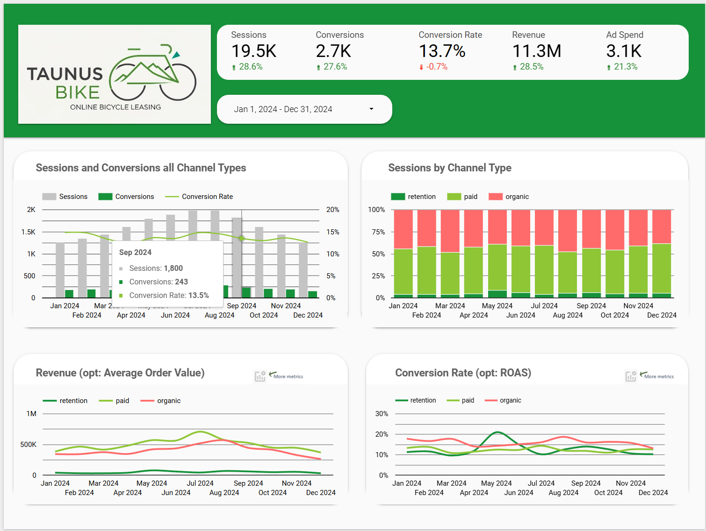
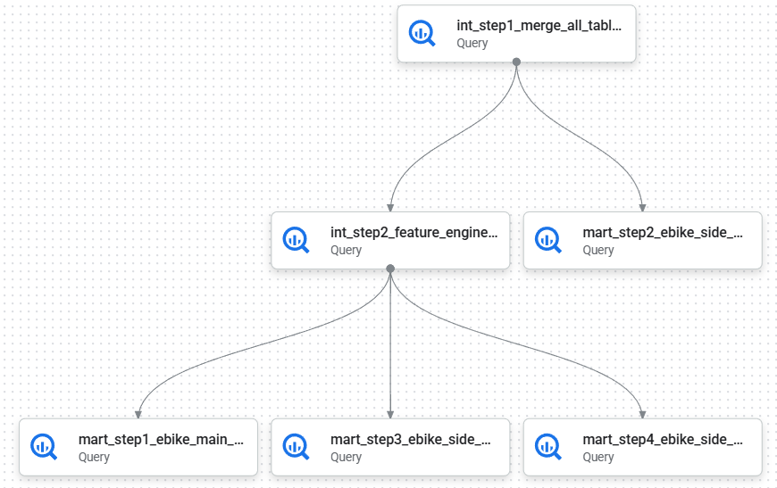
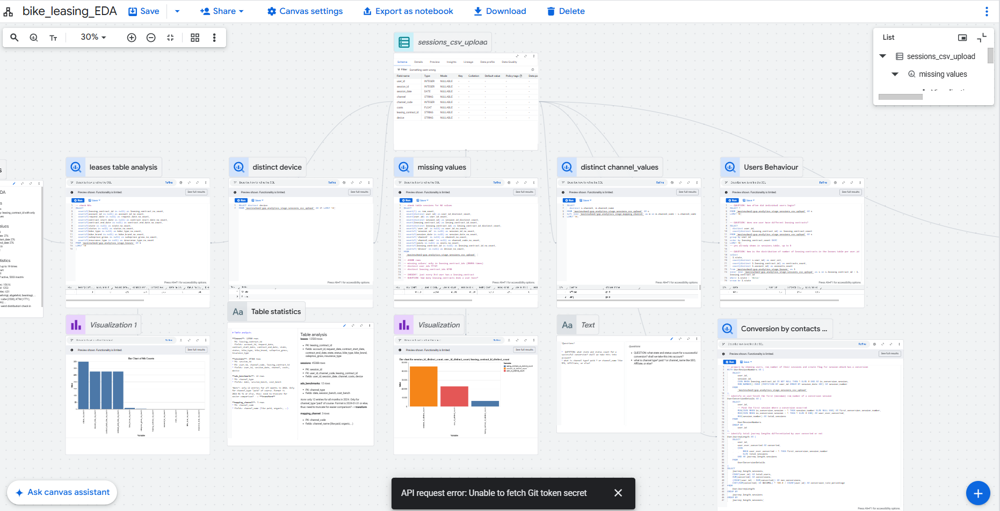

  

<h1 align="center">Online Marketing Performance Dashboard</h1>

  Enjoy reading, let me know what you think and connect on [Linkedin](https://www.linkedin.com/in/thorweber)

## 🎯 Project Overview

> A bike leasing company wants a real-time KPI-dashboard guiding their online marketing decisions with clear and crisp information about different marketing campaigns and their performance. 

##### Tech stack

* 📊 Google Cloud Platform:
  * Cloud Storage,
  * Data Transfer,
  * Big Query,
  * Looker Studio
  * *Big Feature*: Big Query Canvas

##### 📋 Deliverables

- [SQL code](Code)
- [Looker dashboad](https://lookerstudio.google.com/reporting/60f91f12-d01b-43f3-ab8b-10b002e50b7f/page/p_vq8b41cvud)
 
*The final product - page 1*

##### 📜 Multiple data models for better performance

I followed best practices for designing data models providing high performance dashboards with a best fit to the business needs. To make it short: I opted for one main data model for the majority of questions adressing business performance over time and three side models which each answers highly specific questions. The separation of the three side models allows a better aggregation of each model resulting in better dashboard performance. 

##### ⚙️ Big Query's pipeline feature

This is a great way to support your work visually. Of course the hard work is done in SQL as usual, but with the pipeline feature of Big Query you can connect the different scripts and get a visual representation of what is going on. The best is: The scripts run dependently. Following scripts only start if previous scripts have run successfully and you can also run scripts in paralel. Of course, the whole pipeline was scheduled.

## 💪  Skills built

* Created three separate **data models**, suiting the different business questions, cleaned and transformed the data
* Applied **best practices** to three layer data model (stage, integration, consumer)
* **Feature engineering** for basic marketing analytics like conversion rate, ROAS
* Designed and built a **clean, interactive dashboard**
* **New tech stack**: Google Cloud Platform with BigQuery and Looker

## 💡 My Takeaway

Using Google Cloud Platform the first time was an eye opener for me. First of all: Yes it is really exciting working in this highly productive environment. Everything is top-notch and refined for perfect usability. I love it. And after a couple days working with it everything feels absolutely natural. Three aspects I want to highlight: 

##### Six Game-Changing SQL-Commands that **I use every single** day.
* `CREATE OR REPLACE`: For flawless development cycles.
* `UNNEST`: To master nested data like a pro.
* `QUALIFY`: To filter window functions without messy subqueries.
* `_TABLE_SUFFIX`: To slash query costs on partitioned tables.
* `SAFE.`: To make your data pipelines error-proof.
* `IF()`: For lightning-fast conditional logic.

Read my [article](https://www.linkedin.com/pulse/stop-writing-slow-sql-6-bigquery-functions-change-weber-mba-bsc-mleue) on Linked in about it.

##### **Looker Studio** is absolutely underrated

I started learning Tableau Jan 2025. Since then I created dashboards for helping leaders making better decisions. Tableau is a amazing tool and much is written about it. One downside: It has a very steep learning curve and there is not much templates for KPIs visualization. Dashboard design takes practice and time.

Looker Studio on the other hand is a breeze to work with. In seconds it feels you can design a multiple page dashboard. I enjoy the free placement of elements, the workflow and UI. Yes, it lacks the customizability of Tableau. Thus said, it will fulfill most of your daily BI requirements.  

##### The **Data Cavas** of Big Query is AMAZING. 
* This tool is making EDA and collaboration in teams so easy
* Think of it as a miro-style canvas on which you can place code boxes written in SQL or Python for analyzing datasets
* Start with SQL and continue visualizing with Python or use simple Looker-style built-in vizzes
* **This feature is next level!** 

