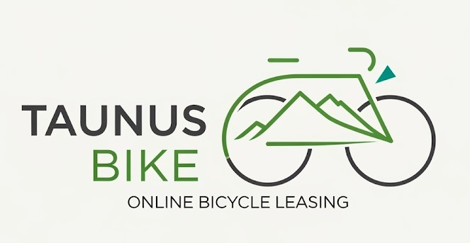

  

<h1 align="center">Online Marketing Performance Dashboard</h1>

  Enjoy reading, let me know what you think and connect on [Linkedin](https://www.linkedin.com/in/thorweber)

## 🎯 Project Overview

> A bike leasing company wants a real-time KPI-dashboard guiding their online marketing decisions with clear and crisp information about different marketing campaigns and their performance. 

##### Tech stack

* 📊 Google Cloud Platform:
  * Cloud Storage,
  * Data Transfer,
  * Big Query,
  * Looker Studio
  * *Big Feature*: Big Query Canvas

##### 📋 Deliverables

- SQL code
- Looker dashboad

<iframe width="600" height="450" src="https://lookerstudio.google.com/embed/reporting/60f91f12-d01b-43f3-ab8b-10b002e50b7f/page/p_klsud3hvud" frameborder="0" style="border:0" allowfullscreen sandbox="allow-storage-access-by-user-activation allow-scripts allow-same-origin allow-popups allow-popups-to-escape-sandbox"></iframe>

Open dashboard in [new tab](https://lookerstudio.google.com/reporting/60f91f12-d01b-43f3-ab8b-10b002e50b7f/page/p_klsud3hvud)

## 💪  Skills built

* Created three separate **data models**, suiting the different business questions, cleaned and transformed the data
* Applied **best practices** to three layer data model (stage, integration, consumer)
* **Feature engineering** for basic marketing analytics like conversion rate, ROAS
* Designed and built a **clean, interactive dashboard**
* **New tech stack**: Google Cloud Platform with BigQuery and Looker

## 💡 My Takeaway

Using Google Cloud Platform the first time was an eye opener for me. First of all: Yes it is really exciting working in this highly productive environment. Everything is top-notch and refined for perfect usability. I love it. And after a couple days working with it everything feels absolutely natural. Three aspects I want to highlight: 

##### Six Game-Changing SQL-Commands that **I use every single** day.
✨ CREATE OR REPLACE: For flawless development cycles.
✨ UNNEST: To master nested data like a pro.
✨ QUALIFY: To filter window functions without messy subqueries.
✨ _TABLE_SUFFIX: To slash query costs on partitioned tables.
✨ SAFE.: To make your data pipelines error-proof.
✨ IF(): For lightning-fast conditional logic.

Read my [article](https://www.linkedin.com/pulse/stop-writing-slow-sql-6-bigquery-functions-change-weber-mba-bsc-mleue) on Linked in about it.

##### **Looker Studio** is absolutely underrated

I started learning Tableau Jan 2025. Since then I created dashboards for helping leaders making better decisions. Tableau is a amazing tool and much is written about it. One downside: It has a very stepp learning curve and there is not much templates for KPIs visualization. Dashboard design takes practice and time.

Looker Studio on the other hand is a breeze to work with. In seconds it feels you can design a multiple page dashboard. I enjoy the free placement of elements, the workflow and UI. Yes, it lacks the customizability of Tableau. Thus said, it will fulfill most of daily BI requirements.  

##### The **Data Cavas** of Big Query is AMAZING. 
* This tool is making EDA and collaboration in teams so easy. 
* Think of it as a miro-style canvas on which you can place code boxes written in SQL or Python for analyzing connected datasets
* Start with SQL and continue visualizing with Python or use simple Looker-style built-in vizzes. 
* **This feature is next level!** 

